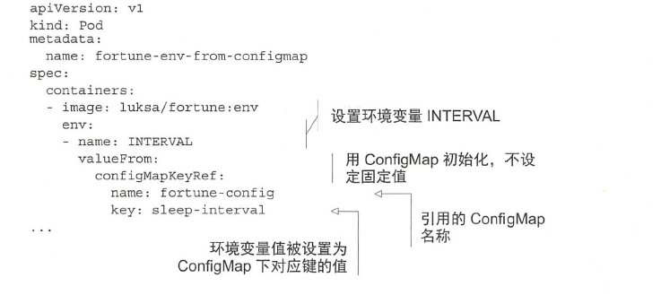
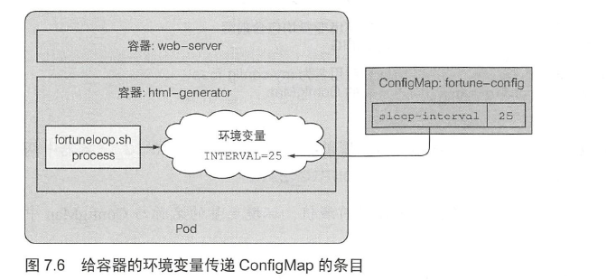

### 1. 容器命令行参数的配置

Docker 使用命令行参数是通过在Dockerfile 中定义Entrypoint 和CMD来实现，但是有个问题啊，这个是打包到镜像里的。先来看看这两个的区别吧。

Entrypoint: 定义容器启动时被调用的可执行程序。

CMD：指定传递给Entrypoint 的参数。

所以常规做法还是定义这两个，用命令行启动时，可以通过命令行的argu来覆盖file中的CMD的定义。当然了还有一种方式，就是脚本方式，可以将命令写入到脚本中，然后在dockerfile中定义调用这个脚本。

POD 中定义的命令可以覆盖容器的命令行。所以可以通过POD的YAML文件中的argu将参数传递给容器。

### 2. POD 环境变量的常规操作

在引出ConfigMap 之前，来看看POD配置环境变量的常规操作。其实你要明白，环境变量是给容器用的，所以呢一种思路就是这样的，在容器中定义好环境变量，容器里的程序引用环境变量，然后在POD的配置文件中对环境变量进行赋值，这就是常规操作。

就像这样的，定义了一个环境变量，然后呢，在POD中对这个变量进行赋值。这个方法呢，怎么样，好吗？显然是不好的，没有解耦，就是环境变量和POD的配置文件强相关了，所以有没好的方法可以实现解耦呢，就是这个配置文件不仅在这里可以用，在其他地方也可以用。这就使用ConfigMap 了。

### 3. ConfigMap

先要理解它要解决的问题，其实就是相当于一个独立的配置文件，然后可以在不同的环境里来引用它。所以这个东西还是蛮好的。创建ConfigMap可以通过命令方式或者YAML文件。不详细讲怎么创建了。

这个例子是，利用POD对容器中的环境变量INTERVAL进行重写。基本过程就是这样的：

不解释了，清楚明了。 但是有个问题啊，如果这个配置文件不存在怎么办，这个POD还能起来吗，答案是否定的。它会一直等存在这个配置文件后，容器才能启动。当然，你也可以设置参数，使其如果没有配置文件也能启动POD。

当然如果你的config file包含很多的key-value，一个一个设置，麻烦，可以一步到位。

prefix 是用来设置前缀的，还有一个，在配置文件中设置的key-value一定要按照格式来，不然的话，Kubernetes 不能解析。

### 4. secert 配置文件

当然，配置文件不能都是名文，对于需要进行加密的需要用secert方式进行配置。secert 和configMap一样也是key - value 方式，但是还是有一些区别，secert 是存在于POD的内存中，所以当删除POD时，就没有了这个配置。
