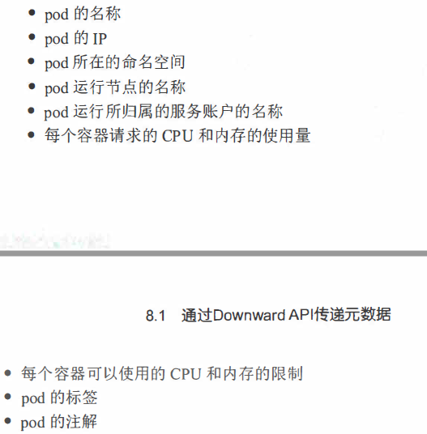
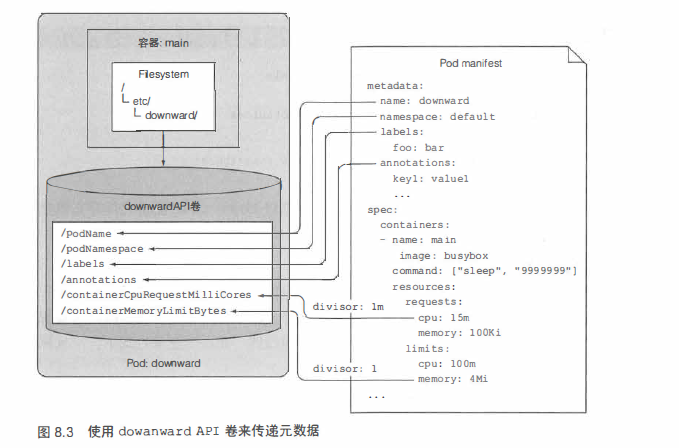
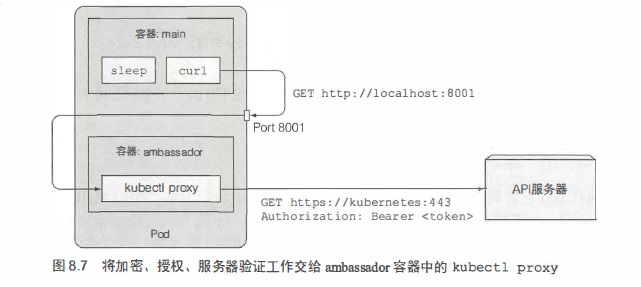

### 1. Downward API传递元数据

说实话，这章看的也是云里雾里的，感觉和环境变量配置差不多。我的理解是，Downward API 是用来给POD或容器的元数据进行配置，环境变量呢，是用来定义一些常规的变量参数。Downward API支持环境变量和文件两种方式，更加灵活。

### 2. Kubernetes API 服务器交互

其实这一节主要就是讲，怎么使用Kubernetes 的API 。使用API其实就是访问它的服务器。每一层目录就是一级资源。

这个是通过ambassador 容器方式来访问API服务器。当然，也可以通过客户端的方式来访问API服务器。这一章内容主要是来配置POD的元数据，同时通过API方式来访问资源。
